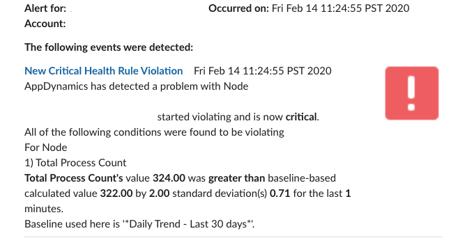

# AppD-Integration-Examples
Integration examples for AppDynamics and Slack

# References

AppDynamics HTTP Request Actions and Templates https://docs.appdynamics.com/display/PRO45/HTTP+Request+Actions+and+Templates

AppDynamics Templating Variables
https://docs.appdynamics.com/display/PRO45/Predefined+Templating+Variables

Slack APIs
https://api.slack.com/block-kit

Apache Velocity Project
https://velocity.apache.org/engine/1.5/user-guide.html#parse

# Example Slack Alert

